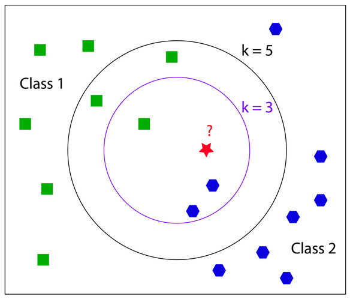
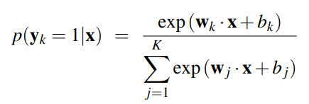
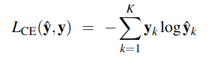
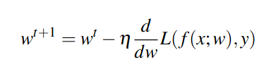
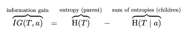
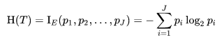
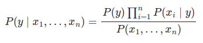
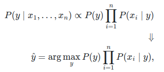
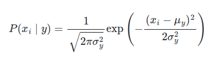

# Description

Create a minimal pipeline to **evaluate** machine learning models and deploy the best one (**ready-to-use**). Additionally, I will implement those algorithms from **scratch**.

## Topics

- **Models**

    Explain how each model works (**training** and **prediction**) and their classes design.

- **Pipeline/Tasks**

    Explain the **steps** to **evaluate** the models and **store/deploy** the best one.

- **Tests**

    Explain how to use **pytest** to test classifiers methods.

- **Running**

    Explain how to run the project.

### CircleCI

To ensure **continuous integration**, I set up two **jobs** to run every time the **master** branch is **pushed**. It will **(1) test classifiers methods** and **(2) deploy the container image** that runs the evaluation task.

### DockerHub

The image is pushed to this repository: [https://hub.docker.com/repository/docker/caiolueno/minimal-pipeline](https://hub.docker.com/repository/docker/caiolueno/minimal-pipeline)

---

## Models

The following models will be implemented:

1. **k-NN**

    Nearest Neighbors is one of the most **simple** and **interpretative** classification models. There is no training, it simply store a labeled dataset. To predict an instance, the model compares it to every “training” instance (**brute force**) using a **distance function**  - euclidean, manhattan, etc - to retrieve its nearest neighbors (k stands for the number of neighbors). Then, extract the **mode** of neighbors’ **labels** as its prediction.

    

2. **Logistic Regression**

    A very popular and powerful method to **estimate weights** of a **hypothesis** function to **minimize** a loss function (**cost**) based on given inputs and desired outputs. The following formula will be used as the hypothesis function:

    

    Example of a binary classification problem.

    where $x$ is a feature vector, $w$ represents a matrix of **weights** and $b$ is a bias value. Since we have labeled data, we can calculate how much this function “cost” given any instance using the following formula:

    

    The main goal is to **minimize** that loss function, because this process will “teach” the model how to “correctly” **map** instances to classes. To accomplish that, we can use a method called **stochastic gradient descent** (quasi-newton) which uses the derivative to discovery which direction the weights should go to minimize the objective function (in our case, the loss function):

    

    $n$ stands for the **learning rate** - the update pace size.

    It is possible to calculate the loss (actually, to **feed forward** instances through the function) for a batch of instances at once, using **matrix operations**. We don’t want to calculate the derivative for instances individually nor for every instance at once. Instead, we will use **mini-batches** - small subset of training instances. For each batch we extract the **mean** of the derivative to **smooth** the learning pace.

    Another hyper-parameter is the number of times we will iterate over the entire dataset: **epochs**.

3. **Decision Tree**

    A simple decision tree classifier. It navigates through a **binary tree** answering **yes or no questions** regarding the input vector until it reaches a leaf node. The following steps describe how to train the model (how it creates the tree nodes):

    1. Receive a labeled set of samples;
    2. For each available feature, **iterate over possible values** to find the best **split point**;
    3. **Create the node** (store the feature and the found threshold in it);
    4. **Generate two subsets** based on the found threshold;

    It is a **recursive algorithm** - it ends as soon as the labeled set contains only instances of one class or max depth (hyper-parameter) is reached.

    To find the **best split point**, it uses the information gain formula:

    

    where H is the following entropy function:

    

    pi is the proportion of samples labeled with the class i.

    The best split point is the value $a$ which **maximizes** the **information gain** (or **minimizes** the sum of **children’s entropy**).

4. **Gaussian Naive Bayes**

    This algorithm uses the **Bayes theorem** to calculate probabilities and make predictions. It is called “**naive**” because it assumes that features are **conditionally independent** between every possible pair. The following image shows the theorem:

    

    We can use a feature vector as $x$ and replace $y$ for a known class and then we obtain a probability estimator for each class. Since $P(x)$ is constant, we can use the following equivalent formula:

    

    $P(y)$ can be estimated using its frequency in the training set. The **Multinomial Naive Baye**s uses **frequency** to estimate $P(x|y)$ as well. But the **Gaussian** assumes that the data has a **normal distribution** and calculate $P(x|y)$ as following:

    

    We also can apply a log function to those probabilities in order to have a more stable result - instead of multiplication we would have a sum. Then, we apply an exponential function before returning $P(y|x)$.

They will support **only multi-class** problems (not multi-label).

### Classes Design

Every model inherits from a class called **BaseClassifier**. It implements common methods such as checks, compress and uncompress folder. Every model must implement the following methods: **fit**, **predict**, **predict_proba**, **save** and **load**. The following image describes their definition:

OOP img

---

## Pipeline/Tasks

The pipeline uses tasks from the [luigi](https://luigi.readthedocs.io/en/stable/index.html) library.

1. **PreProcessTask**
    - **Read data** from source. In this project, it is a .csv file for simplicity;
    - **Scale** features using **StandardScaler**: $z = (x - u) / s$. Save it for later **deploy**.
2. **EvaluationTask**
    - **Evaluate** models (stratified 10-fold and f1-score as metric);
    - **Fit** best model using all data, **save** and **compress** it.
3. **DeployTask**
    - “**Deploy**” both scaler (preprocessing step) and model to final path - locally only 🥸.

---

## Tests

There are tests to test classifiers’ methods - **fit**, **predict**, **predict_proba**, **save** and **load**.

To run the tests use:

```bash
# install requirements
pip install -r requirements-test.txt

# run pytest
PYTHONPATH="." pytest -v --disable-warnings --durations=0
```

---

## Running

### Manually

To run the luigi tasks without setting up the docker, simply run:

```bash
# install requirements
pip install -r requirements-docker.txt

# run tasks
PYTHONPATH="." luigi --module src.tasks.DeployTask DeployTask --in-file data/iris.csv
```

### Docker

To use a docker container  to run the luigi tasks:

```bash
# build image
sudo docker build -t CUSTOM_NAME .

# run
sudo docker run CUSTOM_NAME
```
